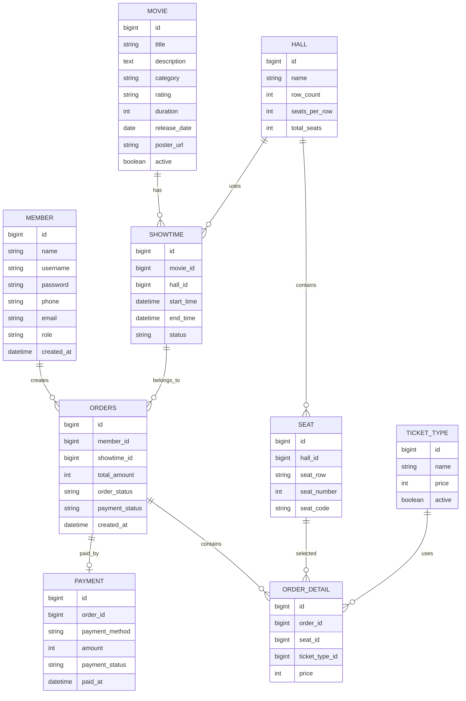
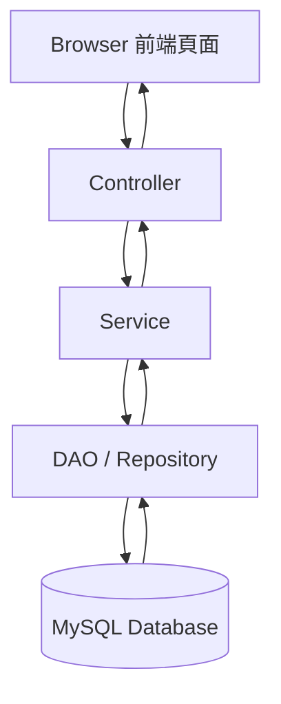
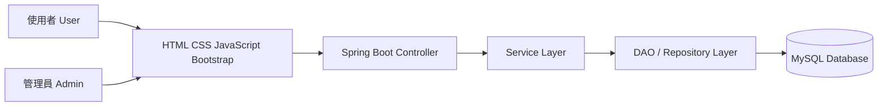
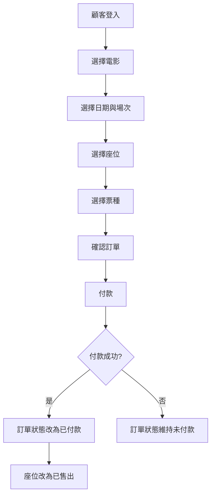
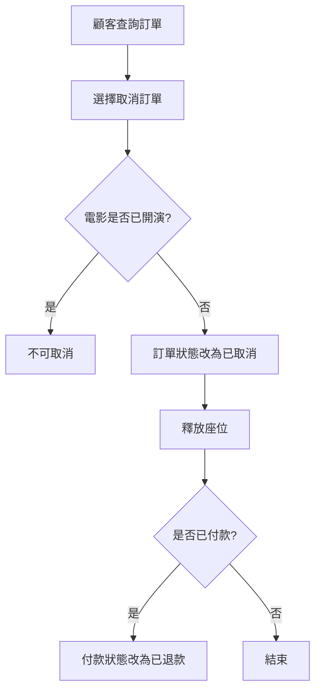
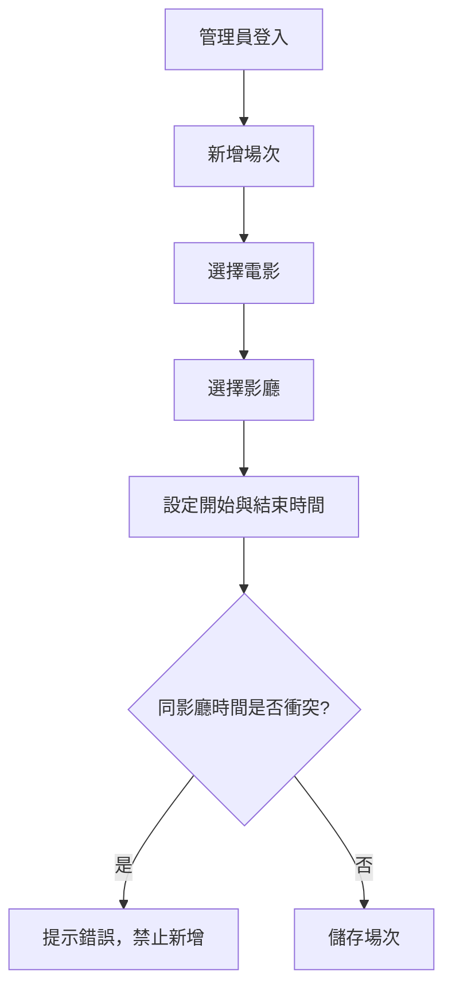
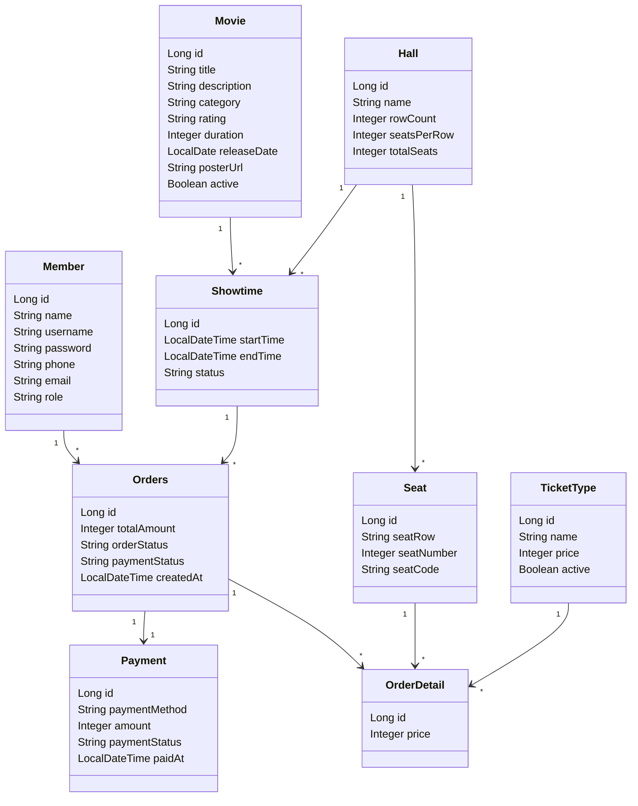

# 電影購票系統完整專題規格書

## 一、專案名稱

電影購票系統 Movie Ticket Booking System

---

## 二、專案目標

本專案目標是製作一套完整的電影購票系統，提供顧客線上查詢電影、選擇場次、選擇座位、購買電影票與查詢訂票紀錄等功能。

後台管理者可以管理電影、影廳、座位、場次、票價、訂單與營收統計。

本系統適合作為 Java / Spring Boot / MySQL 的大學專題或作品集專案。

---

## 三、使用技術

| 類別 | 技術 |
|---|---|
| 前端 | HTML、CSS、JavaScript、Bootstrap |
| 後端 | Spring Boot 3 |
| ORM | Spring Data JPA |
| 資料庫 | MySQL 8 |
| 架構 | MVC + DAO Pattern |
| 開發工具 | Eclipse / IntelliJ IDEA |
| 專案管理 | Maven |
| 版本控制 | Git + GitHub |

---

## 四、系統角色

## 1. 顧客 User

顧客可以使用前台購票功能。

主要功能：

- 註冊會員
- 登入系統
- 查看電影
- 查詢場次
- 選擇座位
- 建立訂單
- 付款
- 查詢訂票紀錄
- 取消訂票

## 2. 管理員 Admin

管理員可以使用後台管理功能。

主要功能：

- 管理電影
- 管理影廳
- 管理座位
- 管理場次
- 管理票種
- 管理訂單
- 查看營收統計

---

# 五、前台功能規劃

## 1. 會員註冊

功能說明：

顧客可以建立會員帳號，之後使用帳號登入系統購票。

欄位建議：

- 會員姓名
- 帳號
- 密碼
- 電話
- Email
- 建立時間

---

## 2. 會員登入

功能說明：

顧客輸入帳號與密碼後登入系統。

登入成功後可以進行購票、查詢訂單等功能。

---

## 3. 電影列表

功能說明：

顧客可以查看目前上映中的電影。

顯示資料：

- 電影名稱
- 電影海報
- 電影分級
- 電影類型
- 片長
- 上映日期
- 電影簡介
- 是否上映中

---

## 4. 電影詳細資料

功能說明：

點選電影後，可以查看該電影的詳細資訊與可購買場次。

顯示資料：

- 電影名稱
- 電影海報
- 電影簡介
- 電影類型
- 電影分級
- 片長
- 場次列表

---

## 5. 場次查詢

功能說明：

顧客可以依照電影與日期查詢可購買的場次。

查詢條件：

- 電影
- 日期
- 影廳
- 播放時間

顯示資料：

- 電影名稱
- 播放日期
- 播放時間
- 影廳名稱
- 剩餘座位數

---

## 6. 選位功能

功能說明：

顧客選擇場次後，可以查看座位圖並選擇座位。

座位狀態：

- 可選
- 已售出
- 已選取

規則：

- 已售出的座位不能再次購買
- 顧客可以選擇一個或多個座位
- 顧客可以取消已選取座位
- 訂單建立後座位狀態改為已售出

---

## 7. 選擇票種

功能說明：

顧客選擇座位後，需要選擇票種。

票種範例：

- 全票
- 學生票
- 優待票
- 兒童票

系統需依票種計算金額。

---

## 8. 建立訂單

功能說明：

顧客確認電影、場次、座位、票種與金額後，建立訂單。

訂單資料：

- 訂單編號
- 會員
- 電影
- 場次
- 座位
- 票種
- 總金額
- 訂單狀態
- 建立時間

訂單狀態：

- 未付款
- 已付款
- 已取消

---

## 9. 付款功能

功能說明：

顧客可以選擇付款方式並完成付款。

付款方式：

- 現金
- 信用卡
- 行動支付

付款狀態：

- 未付款
- 已付款
- 付款失敗
- 已退款

---

## 10. 訂票紀錄查詢

功能說明：

顧客可以查詢自己的訂票紀錄。

顯示資料：

- 訂單編號
- 電影名稱
- 播放時間
- 影廳
- 座位
- 金額
- 付款狀態
- 訂單狀態

---

## 11. 取消訂票

功能說明：

顧客可以取消尚未開演的訂單。

取消規則：

- 電影已開演不可取消
- 已付款訂單取消後付款狀態可改為已退款
- 座位需釋放，讓其他顧客可以購買
- 訂單狀態改為已取消

---

# 六、後台功能規劃

## 1. 管理員登入

功能說明：

管理員登入後可進入後台管理系統。

---

## 2. 電影管理

功能說明：

管理員可以新增、修改、查詢與下架電影。

功能項目：

- 新增電影
- 修改電影
- 查詢電影
- 下架電影

電影資料欄位：

- 電影名稱
- 電影簡介
- 電影類型
- 電影分級
- 片長
- 上映日期
- 海報圖片
- 上映狀態

---

## 3. 影廳管理

功能說明：

管理員可以管理影廳資料。

功能項目：

- 新增影廳
- 修改影廳
- 查詢影廳
- 設定座位數量

影廳資料欄位：

- 影廳名稱
- 總座位數
- 排數
- 每排座位數

---

## 4. 座位管理

功能說明：

每個影廳都要有自己的座位資料。

座位格式範例：

- A1
- A2
- A3
- B1
- B2
- C1

座位狀態應依照場次判斷，不是永久固定。

---

## 5. 場次管理

功能說明：

管理員可以設定電影播放場次。

功能項目：

- 新增場次
- 修改場次
- 刪除場次
- 查詢場次

場次資料：

- 電影
- 影廳
- 播放日期
- 開始時間
- 結束時間
- 場次狀態

重要規則：

同一個影廳在同一時間不能安排兩部電影。

---

## 6. 票種與票價管理

功能說明：

管理員可以設定不同票種的價格。

票種範例：

| 票種 | 價格 |
|---|---|
| 全票 | 300 |
| 學生票 | 250 |
| 優待票 | 200 |
| 兒童票 | 180 |

---

## 7. 訂單管理

功能說明：

管理員可以查詢所有顧客訂單。

查詢條件：

- 訂單編號
- 會員姓名
- 電影名稱
- 日期
- 訂單狀態
- 付款狀態

---

## 8. 營收統計

功能說明：

管理員可以查看系統營收狀況。

統計項目：

- 今日營收
- 月營收
- 電影片房排行
- 場次銷售率
- 總訂單數
- 取消訂單數

---

# 七、資料庫設計

## 1. member 會員表

| 欄位 | 型態 | 說明 |
|---|---|---|
| id | BIGINT | 主鍵 |
| name | VARCHAR | 會員姓名 |
| username | VARCHAR | 帳號 |
| password | VARCHAR | 密碼 |
| phone | VARCHAR | 電話 |
| email | VARCHAR | 信箱 |
| role | VARCHAR | USER / ADMIN |
| created_at | DATETIME | 建立時間 |

---

## 2. movie 電影表

| 欄位 | 型態 | 說明 |
|---|---|---|
| id | BIGINT | 主鍵 |
| title | VARCHAR | 電影名稱 |
| description | TEXT | 電影簡介 |
| category | VARCHAR | 類型 |
| rating | VARCHAR | 分級 |
| duration | INT | 片長 |
| release_date | DATE | 上映日期 |
| poster_url | VARCHAR | 海報路徑 |
| active | BOOLEAN | 是否上映中 |

---

## 3. hall 影廳表

| 欄位 | 型態 | 說明 |
|---|---|---|
| id | BIGINT | 主鍵 |
| name | VARCHAR | 影廳名稱 |
| row_count | INT | 排數 |
| seats_per_row | INT | 每排座位數 |
| total_seats | INT | 總座位數 |

---

## 4. seat 座位表

| 欄位 | 型態 | 說明 |
|---|---|---|
| id | BIGINT | 主鍵 |
| hall_id | BIGINT | 影廳 ID |
| seat_row | VARCHAR | 排 |
| seat_number | INT | 號碼 |
| seat_code | VARCHAR | 座位代號，例如 A1 |

---

## 5. showtime 場次表

| 欄位 | 型態 | 說明 |
|---|---|---|
| id | BIGINT | 主鍵 |
| movie_id | BIGINT | 電影 ID |
| hall_id | BIGINT | 影廳 ID |
| start_time | DATETIME | 開始時間 |
| end_time | DATETIME | 結束時間 |
| status | VARCHAR | 場次狀態 |

---

## 6. ticket_type 票種表

| 欄位 | 型態 | 說明 |
|---|---|---|
| id | BIGINT | 主鍵 |
| name | VARCHAR | 票種名稱 |
| price | INT | 票價 |
| active | BOOLEAN | 是否啟用 |

---

## 7. orders 訂單表

| 欄位 | 型態 | 說明 |
|---|---|---|
| id | BIGINT | 主鍵 |
| member_id | BIGINT | 會員 ID |
| showtime_id | BIGINT | 場次 ID |
| total_amount | INT | 總金額 |
| order_status | VARCHAR | 訂單狀態 |
| payment_status | VARCHAR | 付款狀態 |
| created_at | DATETIME | 建立時間 |

---

## 8. order_detail 訂單明細表

| 欄位 | 型態 | 說明 |
|---|---|---|
| id | BIGINT | 主鍵 |
| order_id | BIGINT | 訂單 ID |
| seat_id | BIGINT | 座位 ID |
| ticket_type_id | BIGINT | 票種 ID |
| price | INT | 單張票價 |

---

## 9. payment 付款表

| 欄位 | 型態 | 說明 |
|---|---|---|
| id | BIGINT | 主鍵 |
| order_id | BIGINT | 訂單 ID |
| payment_method | VARCHAR | 付款方式 |
| amount | INT | 付款金額 |
| payment_status | VARCHAR | 付款狀態 |
| paid_at | DATETIME | 付款時間 |

---

# 八、ER Diagram



---

# 九、MVC 架構圖



---

# 十、系統架構圖



---

# 十一、購票流程圖



---

# 十二、取消訂票流程圖



---

# 十三、場次管理流程圖



---

# 十四、UML 類別圖



---

# 十五、建議 Package 架構

```text
movie-ticket-system/
├── src/main/java/com/example/movieticket/
│   ├── MovieTicketApplication.java
│   │
│   ├── controller/
│   │   ├── HomeController.java
│   │   ├── AuthController.java
│   │   ├── MovieController.java
│   │   ├── ShowtimeController.java
│   │   ├── OrderController.java
│   │   └── AdminController.java
│   │
│   ├── entity/
│   │   ├── Member.java
│   │   ├── Movie.java
│   │   ├── Hall.java
│   │   ├── Seat.java
│   │   ├── Showtime.java
│   │   ├── TicketType.java
│   │   ├── Orders.java
│   │   ├── OrderDetail.java
│   │   └── Payment.java
│   │
│   ├── repository/
│   │   ├── MemberRepository.java
│   │   ├── MovieRepository.java
│   │   ├── HallRepository.java
│   │   ├── SeatRepository.java
│   │   ├── ShowtimeRepository.java
│   │   ├── TicketTypeRepository.java
│   │   ├── OrderRepository.java
│   │   ├── OrderDetailRepository.java
│   │   └── PaymentRepository.java
│   │
│   ├── dao/
│   │   ├── MovieDao.java
│   │   ├── ShowtimeDao.java
│   │   └── OrderDao.java
│   │
│   ├── dao/impl/
│   │   ├── MovieDaoImpl.java
│   │   ├── ShowtimeDaoImpl.java
│   │   └── OrderDaoImpl.java
│   │
│   ├── service/
│   │   ├── MemberService.java
│   │   ├── MovieService.java
│   │   ├── ShowtimeService.java
│   │   ├── OrderService.java
│   │   └── RevenueService.java
│   │
│   ├── service/impl/
│   │   ├── MemberServiceImpl.java
│   │   ├── MovieServiceImpl.java
│   │   ├── ShowtimeServiceImpl.java
│   │   ├── OrderServiceImpl.java
│   │   └── RevenueServiceImpl.java
│   │
│   ├── dto/
│   ├── config/
│   ├── util/
│   └── exception/
│
├── src/main/resources/
│   ├── templates/
│   │   ├── index.html
│   │   ├── login.html
│   │   ├── register.html
│   │   ├── movies.html
│   │   ├── movie-detail.html
│   │   ├── showtimes.html
│   │   ├── seats.html
│   │   ├── checkout.html
│   │   ├── orders.html
│   │   └── admin/
│   │       ├── dashboard.html
│   │       ├── movie-manage.html
│   │       ├── hall-manage.html
│   │       ├── showtime-manage.html
│   │       ├── order-manage.html
│   │       └── revenue.html
│   │
│   ├── static/
│   │   ├── css/
│   │   ├── js/
│   │   └── images/
│   │
│   └── application.properties
│
├── pom.xml
└── README.md
```

---

# 十六、從頭開始到完成的開發步驟

## 第 1 步：確認需求

先確認系統要做哪些功能。

建議先完成核心功能：

1. 會員登入
2. 電影列表
3. 場次查詢
4. 座位選擇
5. 建立訂單
6. 付款狀態
7. 訂票紀錄
8. 後台電影管理
9. 後台場次管理
10. 營收統計

---

## 第 2 步：畫出系統流程圖

先畫出：

- MVC 架構圖
- ER Diagram
- 購票流程圖
- 取消訂票流程圖
- 場次管理流程圖
- UML 類別圖

這些圖可以放在 README.md 或專題報告中。

---

## 第 3 步：設計資料庫

先建立資料表：

1. member
2. movie
3. hall
4. seat
5. showtime
6. ticket_type
7. orders
8. order_detail
9. payment

---

## 第 4 步：建立 Spring Boot 專案

使用 Spring Initializr 建立專案。

建議加入依賴：

- Spring Web
- Spring Data JPA
- MySQL Driver
- Thymeleaf
- Lombok

---

## 第 5 步：設定 application.properties

設定 MySQL 連線：

```properties
spring.datasource.url=jdbc:mysql://localhost:3306/movie_ticket_system?serverTimezone=Asia/Taipei&useSSL=false
spring.datasource.username=root
spring.datasource.password=你的密碼

spring.jpa.hibernate.ddl-auto=update
spring.jpa.show-sql=true
spring.jpa.properties.hibernate.format_sql=true

spring.thymeleaf.cache=false
server.port=8080
```

---

## 第 6 步：建立 Entity

依序建立：

1. Member
2. Movie
3. Hall
4. Seat
5. Showtime
6. TicketType
7. Orders
8. OrderDetail
9. Payment

Entity 對應資料庫資料表。

---

## 第 7 步：建立 Repository

每個 Entity 建立一個 Repository。

範例：

```java
public interface MovieRepository extends JpaRepository<Movie, Long> {
    List<Movie> findByActiveTrue();
}
```

---

## 第 8 步：建立 DAO 與 DAO Impl

雖然 Spring Data JPA 已經有 Repository，但為了符合 MVC + DAO Pattern，可以讓 DAO 包裝 Repository。

範例：

```java
public interface MovieDao {
    List<Movie> findAllActiveMovies();
}
```

```java
@Repository
public class MovieDaoImpl implements MovieDao {

    private final MovieRepository movieRepository;

    public MovieDaoImpl(MovieRepository movieRepository) {
        this.movieRepository = movieRepository;
    }

    @Override
    public List<Movie> findAllActiveMovies() {
        return movieRepository.findByActiveTrue();
    }
}
```

---

## 第 9 步：建立 Service 與 Service Impl

Service 負責商業邏輯。

例如：

- 判斷座位是否已售出
- 計算訂單總金額
- 檢查場次時間是否衝突
- 計算日營收與月營收

---

## 第 10 步：建立 Controller

Controller 負責接收前端請求。

建議先做：

1. HomeController
2. AuthController
3. MovieController
4. ShowtimeController
5. OrderController
6. AdminController

---

## 第 11 步：製作前端頁面

建議頁面順序：

1. index.html 首頁
2. login.html 登入
3. register.html 註冊
4. movies.html 電影列表
5. movie-detail.html 電影詳細
6. showtimes.html 場次選擇
7. seats.html 座位選擇
8. checkout.html 確認訂單
9. orders.html 訂票紀錄
10. admin/dashboard.html 後台首頁

---

## 第 12 步：完成電影列表功能

流程：

```text
movies.html
→ MovieController
→ MovieService
→ MovieDao
→ MovieRepository
→ movie 資料表
```

先確定電影資料可以正常顯示。

---

## 第 13 步：完成場次查詢功能

流程：

```text
movie-detail.html
→ ShowtimeController
→ ShowtimeService
→ ShowtimeDao
→ ShowtimeRepository
→ showtime 資料表
```

需要顯示：

- 電影
- 影廳
- 日期
- 開始時間
- 剩餘座位

---

## 第 14 步：完成選位功能

選位是整個系統比較重要的功能。

邏輯：

1. 根據場次找到影廳
2. 根據影廳找出全部座位
3. 根據場次查詢已被購買的座位
4. 前端顯示座位圖
5. 已售出座位不能點
6. 可選座位可以點
7. 送出後建立訂單

---

## 第 15 步：完成建立訂單功能

建立訂單時需要：

1. 新增 orders
2. 新增 order_detail
3. 計算 total_amount
4. 設定 order_status
5. 設定 payment_status

---

## 第 16 步：完成付款功能

付款後更新：

- orders.payment_status = 已付款
- orders.order_status = 已成立
- payment.payment_status = 已付款

---

## 第 17 步：完成訂票紀錄功能

顧客登入後可以查看自己的訂單。

顯示：

- 電影名稱
- 播放時間
- 座位
- 金額
- 狀態

---

## 第 18 步：完成取消訂票功能

取消時要處理：

1. 檢查電影是否已開演
2. 訂單改為已取消
3. 如果已付款，付款狀態改為已退款
4. 座位釋放

---

## 第 19 步：完成後台電影管理

管理員可以：

- 新增電影
- 修改電影
- 下架電影
- 查詢電影

---

## 第 20 步：完成後台影廳與座位管理

管理員新增影廳後，可以自動產生座位。

例如：

影廳有 5 排，每排 10 個座位。

系統自動產生：

```text
A1 A2 A3 ... A10
B1 B2 B3 ... B10
C1 C2 C3 ... C10
D1 D2 D3 ... D10
E1 E2 E3 ... E10
```

---

## 第 21 步：完成後台場次管理

新增場次時必須檢查：

同一影廳同一時間不可重複排片。

---

## 第 22 步：完成票價管理

管理員可以設定票種與價格。

---

## 第 23 步：完成訂單管理

管理員可以查詢所有訂單。

---

## 第 24 步：完成營收統計

統計方式：

- 今日營收：查詢今天已付款訂單總金額
- 月營收：查詢本月已付款訂單總金額
- 電影片房：依電影分組計算營收
- 場次售票率：已售座位 / 總座位

---

## 第 25 步：測試功能

測試項目：

1. 會員是否可以註冊
2. 會員是否可以登入
3. 電影是否正常顯示
4. 場次是否正常顯示
5. 座位是否正常顯示
6. 已售出座位是否不能再選
7. 訂單是否正確建立
8. 金額是否正確
9. 付款狀態是否正確
10. 取消訂票是否釋放座位
11. 管理員是否能新增電影
12. 管理員是否能新增場次
13. 營收統計是否正確

---

## 第 26 步：整理 README.md

README.md 建議包含：

1. 專案介紹
2. 使用技術
3. 系統功能
4. 系統架構圖
5. ER Diagram
6. UML 類別圖
7. 操作流程圖
8. 資料庫說明
9. 安裝方式
10. 執行方式
11. 畫面截圖
12. 作者資訊

---

## 第 27 步：上傳 GitHub

流程：

1. 建立 GitHub Repository
2. 初始化 Git
3. 加入檔案
4. Commit
5. Push 到 GitHub

指令：

```bash
git init
git add .
git commit -m "Initial commit"
git branch -M main
git remote add origin 你的GitHub網址
git push -u origin main
```

---

# 十七、建議開發順序

## 第一階段：資料與基礎架構

1. 建立 Spring Boot 專案
2. 設定 MySQL
3. 建立 Entity
4. 建立 Repository
5. 建立 DAO
6. 建立 Service
7. 建立 Controller

---

## 第二階段：前台功能

1. 首頁
2. 登入
3. 註冊
4. 電影列表
5. 電影詳細頁
6. 場次查詢
7. 選位
8. 訂單確認
9. 付款
10. 訂票紀錄
11. 取消訂票

---

## 第三階段：後台功能

1. 管理員登入
2. 後台首頁
3. 電影管理
4. 影廳管理
5. 座位管理
6. 場次管理
7. 票價管理
8. 訂單管理
9. 營收統計

---

## 第四階段：測試與美化

1. 測試所有功能
2. 修正 Bug
3. 美化 Bootstrap 頁面
4. 補上錯誤提示
5. 補上成功提示
6. 整理 README.md
7. 上傳 GitHub

---

# 十八、專題最低完成版本

如果時間不夠，至少完成以下功能：

## 顧客端

- 會員登入
- 電影列表
- 場次選擇
- 座位選擇
- 建立訂單
- 查詢訂票紀錄

## 管理端

- 電影管理
- 場次管理
- 訂單查詢
- 今日營收
- 月營收

這樣已經可以算是一個完整的電影購票系統。

---

# 十九、進階加分功能

如果想讓專題更完整，可以加入：

1. 電影海報上傳
2. QR Code 電子票
3. Email 訂票通知
4. 信用卡模擬付款
5. 會員點數
6. 優惠券
7. 電影評論
8. 熱門電影排行
9. 場次剩餘座位即時更新
10. PDF 電子票

---

# 二十、總結

電影購票系統的核心是：

1. 電影資料
2. 場次資料
3. 座位資料
4. 訂單資料
5. 付款資料
6. 營收統計

開發時建議不要一開始就做太複雜，應該先完成基本流程：

```text
登入 → 選電影 → 選場次 → 選座位 → 建立訂單 → 付款 → 查詢訂單
```

等基本流程完成後，再加入後台管理、營收統計與進階功能。
